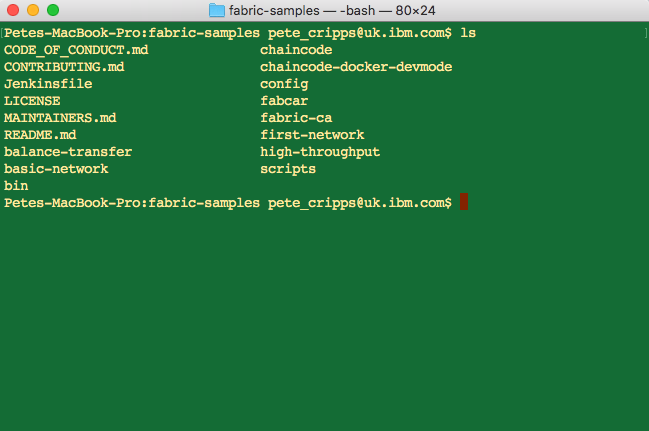

# Step 2: Install Samples, Binaries and Docker Images
There is currently no installer for Hyperledger Fabric binaries but from the Hyperledger Fabric site you can get a script which will download and install samples and binaries to your local system.

The latest instructions for doing this (i.e. for the current version of Hyperledger Fabric) can be obtained [here](https://hyperledger-fabric.readthedocs.io/en/release-1.2/install.html).

You need to download samples into a new directory. I use a one that indicates the version of Fabric it contains: `fabricv12`. Once you have installed the samples following the above instructions you will end up with a set of files and subdirectories as below.



You will see there are a number of samples that have been downloaded, we'll be using the `first-network` one. Commands in the rest of these instructions must be run from there so change to that directory now e.g. (assuming you created `fabricv12` off your $HOME directory):
```
$ cd $HOME/fabricv12/fabric-samples/first-network
```

A fully annotated script `byfn.sh` that leverages the downloaded Docker images to quickly bootstrap a Hyperledger Fabric network comprised of 4 peers representing two different organizations, and an orderer node is provided. The script will also launch a container to run a scripted execution that will join peers to a channel, deploy and instantiate chaincode and drive execution of transactions against the deployed chaincode. To get help on the commands enter:
```
$ ./byfn.sh -h
```

To generate a first network execute the following command:
```
$ ./byfn.sh generate
```

This first step generates all of the certificates and keys for the various network entities, the genesis block used to bootstrap the ordering service, and a collection of configuration transactions required to configure a channel.

Next, you can bring the network up with one of the following commands:
```
./byfn.sh up
```

The above command will compile Golang chaincode images and spin up the corresponding containers. Go is the default chaincode language, however there is also support for Node.js chaincode. If you’d like to run through this tutorial with node chaincode, pass the following command instead:
```
./byfn.sh up -l node
```

To bring down the network enter the following command:
```
./byfn.sh down
```

To learn more about the underlying tooling and bootstrap mechanics look at the detailed instructions which can be found [here](https://hyperledger-fabric.readthedocs.io/en/release-1.2/build_network.html).

Now go to [Step 3: Test the First Network](../docs/TestFirstNetwork.md)
